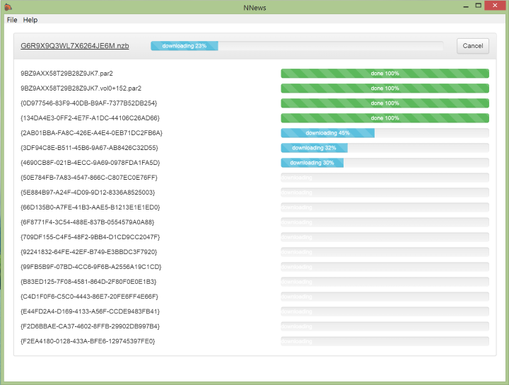
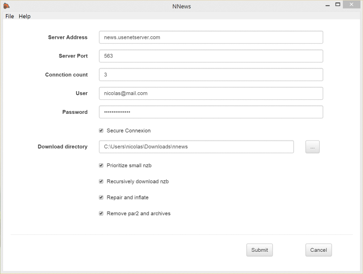

## About

This application is a binary newsgroup reader made with Electron Typescript and React.
It has been tested on Linux and Windows but should work as well on MacOs since no native node module is being used.

### Features

+ Multiple connections to newsgroup server.
+ Repare and unzip downloaded nzbs.
+ Only download extra par2 if repair needed.
+ Resume downloads at restart.
+ Process small nzb files first.
+ Recursive nzb files download.

## Build

Make sure 7z executable is installed and in the path.

```shell
$ npm update
$ grunt ts webpack electron package
```

## Usage

launch nNews.exe or nNews from directory nnews-win32-x64\ or nNews from nnews-linux-x64\ .

Configuration screen is popped up at first startup. 

## Test

```shell
$ npm test
```

## Screenshots



